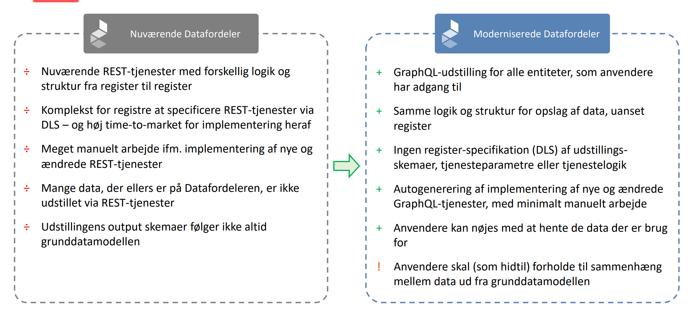
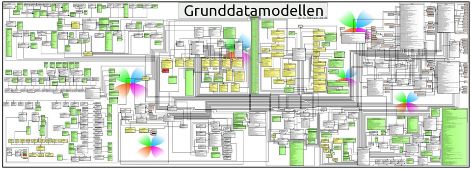
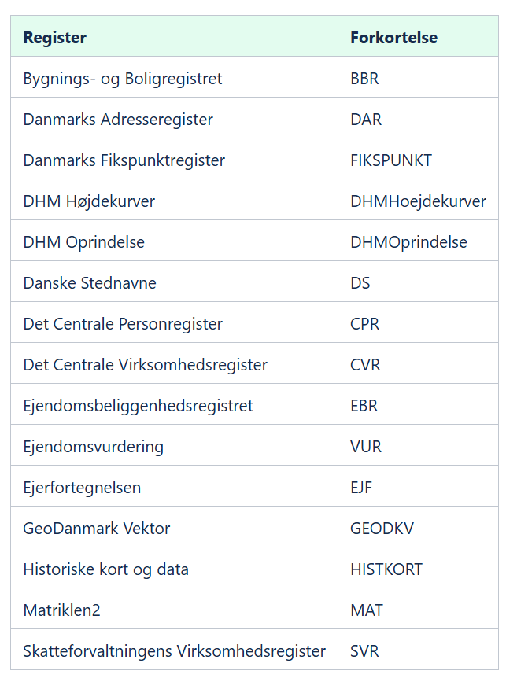
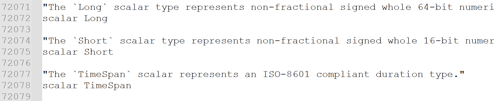
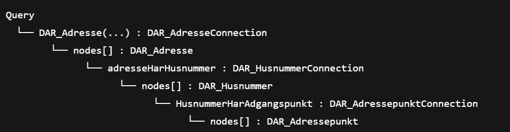
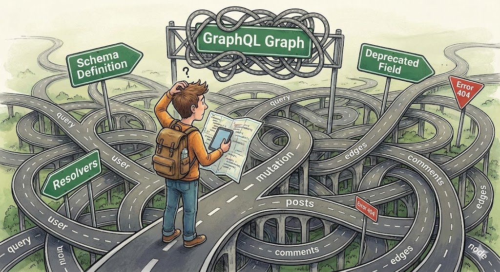
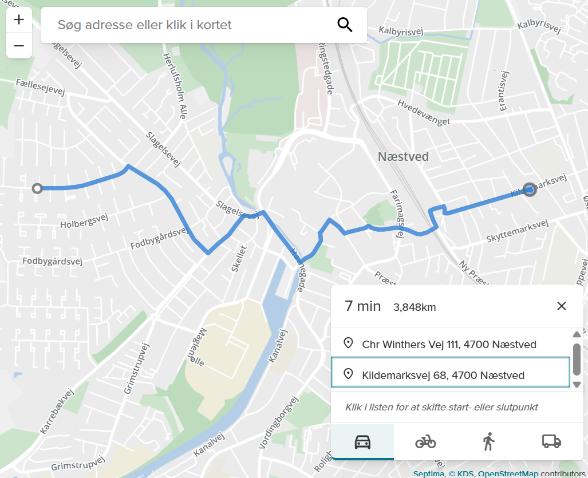
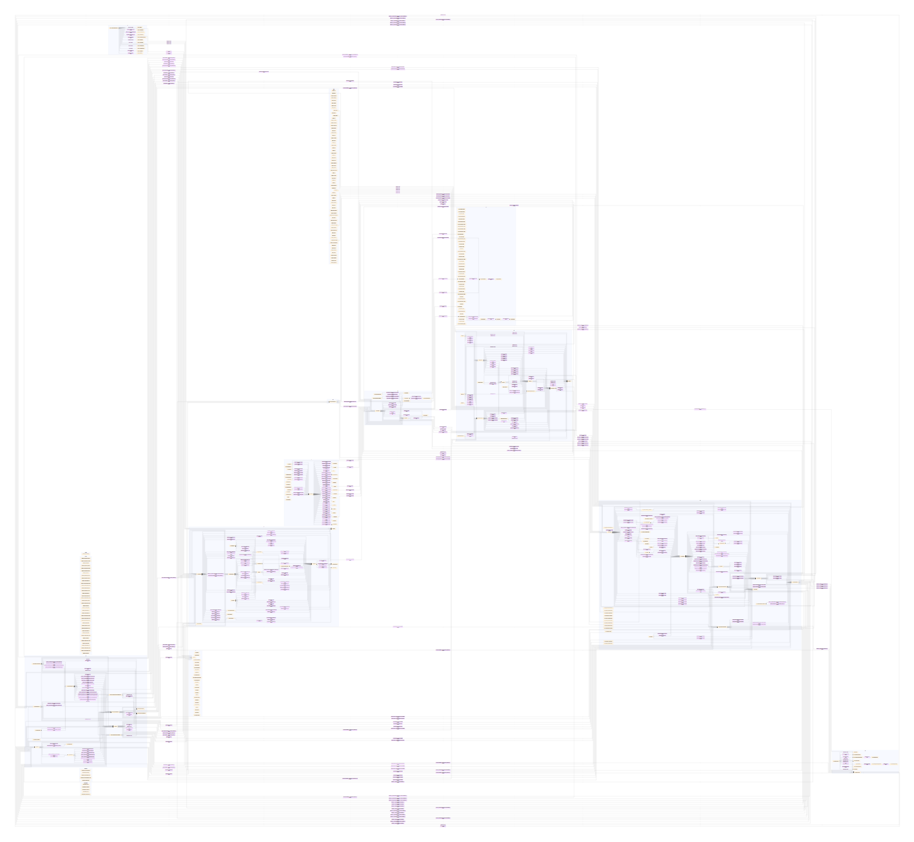
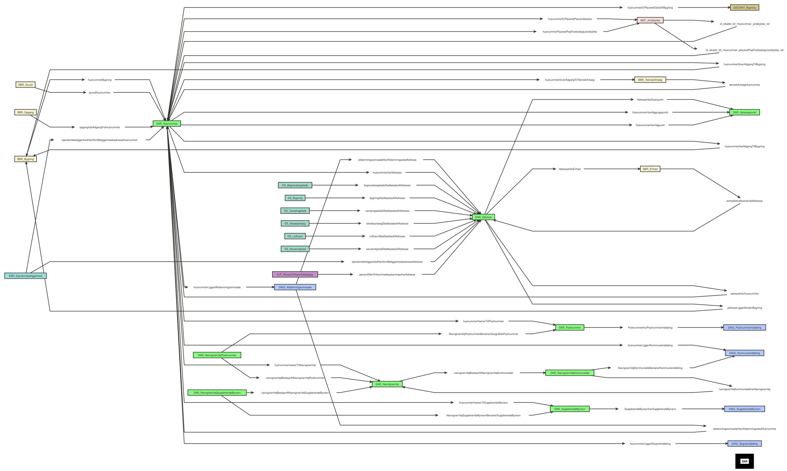
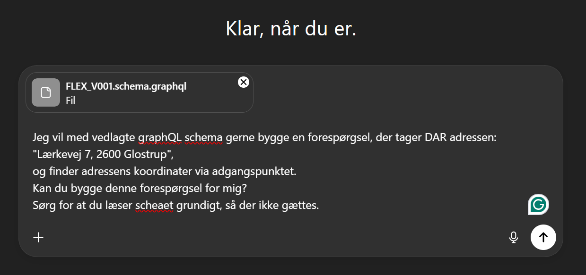

<h1 style="font-size:80px;color:white">Fleksibel opslagslogik og GraphQL</h1>

<h1 style="font-size:30px;color:white">Morten Fuglsang, Septima</h1>


<style>
section::after {
  content: attr(data-marpit-pagination) '/' attr(data-marpit-pagination-total);
}
</style>

---


<h1 style="font-size:50px;color:white">Hvorfor dette seminar ?</h1>
<br>




---


<h1 style="font-size:40px;color:white">Hvornår sker skiftet ?</h1>

*Finansministeriet har i forbindelse med Forslag til finanslov 2026 bevilget budget til paralleldrift på Datafordeleren frem til den 30. juni 2026. Det betyder, at de ikke-moderniserede tjenester skal være udfaset, og at paralleldrift vil ophøre 30. juni 2026.*


```
https://datafordeler.dk/vejledning/modernisering/
```

---


<h1 style="font-size:50px;color:white">Hvad skal vi igennem ?</h1>

* Kort repetition på GraphQL 

* Adgang til den fleksible opslagslogik 

* Det fleksible schema

* Konstruktion af forespørgsler

* Eksempler på anvendelse 

* Kendte begrænsninger

---


<h1 style="font-size:50px;color:white">Lige for at slå det fast...</h1>

Jeg er **ANVENDER** på Datafordeleren - mine eksempler og erfaringer er skabt på grund af brug af services.
<br/>
Jeg kan svare på mange **HVORDAN** sprøgsmål (men langt fra allle) - og bestemt ikke på **HVORFOR** spørgsmål.

---


<h1 style="font-size:50px;color:white">Recap - GraphQL på Datafordeleren</h1>

---


<h1 style="font-size:50px;color:white">GraphQL schemas</h1>

Et **GraphQL-schema** definerer de typer og felter, du kan spørge om i API’et.

Schemaet fungerer som:
- En **kontrakt** mellem klient og server
- En **struktur** over alle data og deres relationer
- En **validering** af dine queries

Et schema består af:
- `type` – definerer objekttyper (f.eks. `Adresse`, `Vejstykke`)
- `Query` – definerer tilgængelige (læse)operationer


---


- **Entitet**: Hver query skal specificere hvilken entitet den omhandler. Eksemplet kan være entiteten BBR_Bygning fra BBR og 
- **Endepunkt**: En query sendes til et GraphQL-endepunkt som et GET- eller POSTrequest.
- **Standardfiltre**: En query kan indeholde standardfiltre der filtrerer data. Query’en
- for eksempel et  lighedsfilter (eq: "0550") på kommunekode-kolonnen
---


- **Geometriske filtre**: En query kan indeholde geometriske filtre, der filtrerer
data på baggrund af geometri.
- **Bitemporale filtre**: En query skal også indeholde bitemporale filtre. For eksempel et  bitemporalt point-in-time-filter (virkningstid: "2024-11-12T14:41:33Z") på virkningstidspunktet.
- **Paging** : En query kan også definere hvordan data pagineres. Returnerer de første 10 rækker (first: 10) givet filtreringen samt paginginformation for resultatsættet (angivet i ”pageInfo”). 


---


```graphql
query {
    BBR_Bygning( # Entitet
        where: { # Standardfiltre
            kommunekode: { eq: "0550" }
        }
        virkningstid: "2024-11-12T14:41:33Z" # Bitemporalt filter
        first: 12 # Paging
        ) {
        pageInfo { # Paginginformation
            startCursor
            endCursor
            hasNextPage
            hasPreviousPage
        }
        nodes {
            id_lokalId
            kommunekode
            virkningsaktoer
        }
    }
}
```

---


```json
    "data": {
        "BBR_Bygning": {
            "pageInfo": {
                "startCursor": "TURBd01ESTBOMk...d0t6QXdPakF3",
                "endCursor": "TURBd01ESTBOMkV0TkdKbFl...NHdNVFl6TVRjd0t6QXdPakF3",
                "hasNextPage": true,
                "hasPreviousPage": false
            },
            "nodes": [
                {
                    "id_lokalId": "0000247a-4beb-4e08-8217-d3246a66ffc3",
                    "kommunekode": "0550",
                    "virkningsaktoer": "Konvertering2017"
                },
                {
                    "id_lokalId": "0000247a-4beb-4e08-8217-d3246a66ffc3",
                    "kommunekode": "0550",
                    "virkningsaktoer": "EksterntSystem"
                }
            ]
        }
    }
}

```

---


<h1 style="font-size:50px;color:white">Adgang til den fleksible opslagslogik </h1>


---


<div class="container">
<div class="col">


</br>
</br>

* Som tidliger - det er ikke længere nok med en webbruger og en tjenestebruger.

* Hvis man skal have adgang til frie data, er en token nok, men den skal oprettes

</div>

<div class="col">
</br>
</br>


</div>
</div>

---


---


---


---


---


---


<h1 style="font-size:50px;color:white">Det fleksible schema</h1>

* Realtioner i grunddataprogrammet

* Endpoints 

* Som text

* Som diagrammer

---

<h1 style="font-size:50px;color:white">Grunddatamodellen</h1>



https://www.version2.dk/artikel/fra-cpr-numre-til-vandloeb-dyk-ned-i-den-samlede-model-danske-grunddata

---


<h1 style="font-size:50px;color:white">Dokumentation</h1>

```
https://confluence.sdfi.dk/pages/viewpage.action?pageId=187105434#GraphQLp%C3%A5Datafordeleren-GraphQL-endepunkter

https://confluence.sdfi.dk/display/DML/Fleksibel+opslagslogik
```

---

<h1 style="font-size:50px;color:white">Endpoints</h1>


<div class="container">
<div class="col">


GraphQL-tjenesterne udstilles gennem URL'er, der følger nedenstående form:

```
https://graphql.datafordeler.dk/<register>/<version>
```
</div>

<div class="col">



</div>
</div>


---


<h1 style="font-size:50px;color:white">Som text</h1>

Udgører knap 74.000 linjer - indeholder representation af grunddata som edges, nodes and connections



---




---


<br/>


---


<h1 style="font-size:50px;color:white">Ruteberegning ? </h1>

<div class="container">
<div class="col">


Som når vi navigerer, skal vi tænke vores GraphQL graph som et vejnet.

* Hvor starter du ?

* Har du stop på vejen ?

* Hvor skal du ende ?

</div>

<div class="col">



</div>
</div>

---


<h1 style="font-size:50px;color:white">Konstruktion</h1>


Spørgsmålene kan relateres :

* Hvilke data er mit udgangspunkt ?
  * Har jeg en adresse, en matrikel eller en virksomhed jeg vil søge ud fra ?
  * Skal jeg bruge et udtræk af adresser med oplysninger, eller det virksomheder jeg vil søge ?

* Hvilke data skal jeg slutte med ? 
  * BBR enheder for adresser ? Jordstykker for adresser ?

* Er der data 'på vejen' jeg skal bruge ?
  * BBR opgange på relationene mellem adresse og enhed ?

---


<h1 style="font-size:50px;color:white">Grafisk visning</h1>

For at kunne skabe den forståelse, er en grafisk visning meget nemmere end teksten...

KDS har et webinar den 11/12 med dette specifikke formål - det vil jeg anbefale at man ser.

_Modelsekretariatet i KDS afholder et webinar, der giver Indblik i en metode til at identificere og forstå relationer i Grunddatamodellen.
Tilmeld dig til webinaret via daf2@kds.dk._

---


<h1 style="font-size:50px;color:white">KDS' Mermaid diagram</h1>


<div class="container">
<div class="col">
<br/>

* Vises i en browser

* Kan navigeres som et webkort

* Indeholder al information fra schemaet i et samlet overblik

<br/>
<br/>
<br/>

Lad os se det engang...

</div>

<div class="col">



</div>
</div>

---


<h1 style="font-size:50px;color:white">Egne fortolkninger</h1>

Vi har i Septima forsøgt med at adskille det i registre og tilknyttet farvekodning.

Jvf. det tidligere slide, så skal vi alligevel finde et 'startpunkt' - og det kan man med fordel så bruge de mindre diagrammer til.


---




Lad os se lidt på dem...

---

<h1 style="font-size:50px;color:white">Konstruktion af forespørgsler</h1>

* Når man har en ide om hvilket indhold man gerne vil have ud, og hvor man skal starte, så er opgaven at bygge forespørgslen op. Dette kan gøres på mange mere eller mindre smarte måder.


---


<h1 style="font-size:50px;color:white">ChatGPT</h1>

For mange vil første tanke nok være AI.

* ChatGPT kan læse schemaet (Det kræver dog en større plan)
  * Det kræver også noget tålmodighed, det går langsomt...

---


```
Jeg vil med vedlagte graphQL schema gerne bygge en forespørgsel, der tager DAR adressen:
"Lærkevej 7, 2600 Glostrup",
og finder adressens koordinater via adgangspunktet.
Kan du bygge denne forespørgsel for mig?
Sørg for at du læser scheaet grundigt, så der ikke gættes.
```



Lad os se hvad der sker...


---


<h1 style="font-size:50px;color:white">Postman</h1>

Den bedste mulighed jeg kender til, er i Postman, hvor man også kan give den schemaet...
- Lad os se hvordan det foregår 

* Guiden 'Postman Guide til GraphQL' fra KDS ligger i mit Github Repo, den beskriver dette i detaljen 

---


<h1 style="font-size:50px;color:white">Eksempler på anvendelse </h1>

Lad os se nogle af 'mine' eksempler

---


<h1 style="font-size:50px;color:white">Kendte begrænsninger </h1>

* Max 20 joins pr. forespørgsel

* Ingen brug af alias'er

* Kun en root-node pr. forespørgsel


---


<h1 style="font-size:50px;color:white">Alle ressourcer vi har brugt i dag, kan hentes på Github </h1>

</br>

Github.com/MFuglsang/graphql_datafordeleren

</br>

Her er bla. en pdf med en lang række eksempler - langt flere end vi har vist her...

---


<h1 style="font-size:50px;color:white">Spørgsmål, opsamling og afslutning</h1>


---


<h1 style="font-size:80px;color:white">Tak for i dag...</h1>