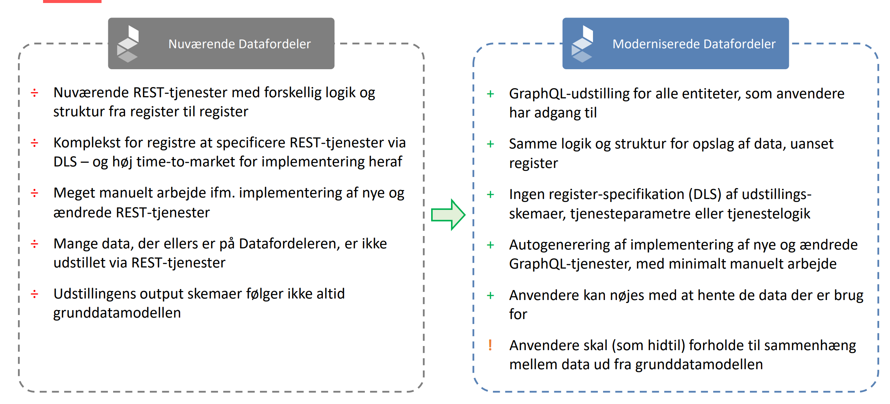
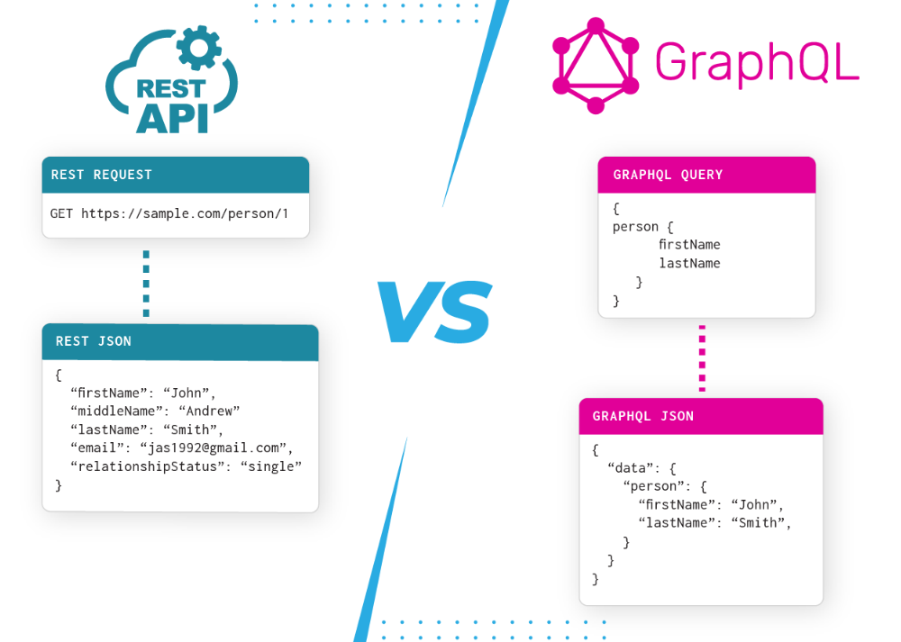

<h1 style="font-size:80px;color:white">GraphQL på Datafordelren</h1>

<h1 style="font-size:30px;color:white">Margit Kildevang, Klimadatastyrelsen</h1>
<h1 style="font-size:30px;color:white">Morten Fuglsang, Septima</h1>


<style>
section::after {
  content: attr(data-marpit-pagination) '/' attr(data-marpit-pagination-total);
}
</style>

---


<h1 style="font-size:50px;color:white">Hvorfor dette seminar ?</h1>
<br>




---


<h1 style="font-size:50px;color:white">Dagens program</h1>

<h2> 13.00 - 13.30 : Introduktion og status XXX KDS</h2>

<h2> 13.30 - 13.50 : Introduktion til GraphQL</h2>

<h2> 13.50 - 14.00 : Pause</h2>

<h2> 14.00 - 14.45 : Hands on eksempler på GraphQL forespørgsler </h2>

<h2> 14.45 - 15.00 : Spørgsmål, opsamling og afslutning</h2>


---


<h1 style="font-size:50px;color:white">Introduktion og status</h1>

---


<h1 style="font-size:50px;color:white">Introduktion til GraphQL</h1>

---


<h1 style="font-size:50px;color:white">Hvorfor GraphQL</h1>

<h2>Før GraphQL: REST dominerede API-verdenen</h2>

Udfordringer med REST:

* Overfetching og underfetching af data

* Mange API-kald for at hente relaterede data

* Vanskeligt at tilpasse data til forskellige klienter (web, mobil)

---


<h1 style="font-size:50px;color:white">Fødselen af GraphQL hos Facebook</h1>

* Skabt af Facebook i 2012 som intern løsning

* Bruges først i deres mobile app til nyhedsfeedet

* Offentliggjort som open source i 2015

* Formål: Effektiv og fleksibel datatilgængelighed med ét enkelt kald


---


<h1 style="font-size:50px;color:white">GraphQL i dag</h1>

* Bred adoption hos store virksomheder (GitHub, Shopify, Twitter)

* Bruges til både frontend og backend integrationer

* Aktivt community og voksende økosystem (Apollo, Relay, Hasura osv.)

Et paradigmeskifte: fra ressourcer til grafer


---


<h1 style="font-size:50px;color:white">Hvad er en graf ?</h1>

En **graf** består af:

- **Noder (nodes):** Objekter som fx `Bruger`, `Adresse`, `Postnummer`
- **Kanter (edges):** Relationer mellem objekterne (fx en bruger har en adresse)
- **Felter (fields):** Informationer på hver node

En GraphQL-query følger forbindelserne i grafen  
Du spørger på tværs af datarelationer – fleksibelt

---


<h1 style="font-size:50px;color:white">Hvad er en query ?</h1>

<div class="container">
<div class="col">

**Query**: Nøgleordet for en læseoperation

Vi beder om et user-objekt med id = "123"

Vi specificerer præcis hvilke felter vi vil have: id, name, email

</div>

<div class="col">

```graphql
query {
  user(id: "123") {
    id
    name
    email
  }
}
```
</div>
</div>

---


<h1 style="font-size:50px;color:white">Hvordan sender man en forespørgsel ?</h1>

GraphQL bruger som regel HTTP POST (kan også være GET)
Body’en indeholder query som tekst (JSON)

```http
POST /graphql
Content-Type: application/json

{
  "query": "query { user(id: \"123\") { name email } }"
}
```

---


<h1 style="font-size:50px;color:white">Applikationer</h1>

Man kan i praksis godt bygge en **GET** url, men der skal url-encodes en masse ting.

I praksis vil man ofte benytte en applikation der kan lave **POST** forespørgsler:

* Postman / Insomnia

* Apollo Client

* curl

* GraphQL Playground / GraphiQL

---


<h1 style="font-size:50px;color:white">Response</h1>

<div class="container">
<div class="col">

Response indeholder kun de felter der blev forespurgt

Ingen overflødig data – ingen status, links, osv.

Altid under data-nøglen (fejl kommer i errors)

</div>

<div class="col">

```json
{
  "data": {
    "user": {
      "name": "Alice",
      "email": "alice@example.com"
    }
  }
}

```
</div>
</div>

---


<h1 style="font-size:50px;color:white">Mutations ?</h1>

<div class="container">
<div class="col">

Bruges til at ændre data (oprette, opdatere, slette)

Ligner en query, men påvirker serverens tilstand

Serveren returnerer typisk det opdaterede objekt

</div>


<div class="col">

```graphql
mutation {
  updateUser(id: "123", input: {
    email: "new@example.com"
  }) {
    id
    name
    email
  }
}
```

</div>
</div>

---




---


<h1 style="font-size:50px;color:white">GraphQL schemas</h1>

Et **GraphQL-schema** definerer de typer og felter, du kan spørge om i API’et.

Schemaet fungerer som:
- En **kontrakt** mellem klient og server
- En **struktur** over alle data og deres relationer
- En **validering** af dine queries

Et schema består af:
- `type` – definerer objekttyper (f.eks. `Adresse`, `Vejstykke`)
- `Query` – definerer tilgængelige læseoperationer
- `Mutation` – definerer skrive-/opdateringsoperationer (hvis tilladt)

Det hele er stærkt typet og dokumenteret...


---


<div class="container">
<div class="col">

**type Adresse** = en type med felterne id og adgangsadresse

'**ID!** = et obligatorisk ID-felt (udråbstegn = required)

**adresse(id: ID!)**: Adresse = query, der returnerer én adresse

**adgangsadresser(...)** = query, der returnerer en liste [...]


</div>


<div class="col">
</br>

```graphql
type Adresse {
  id: ID!
  adgangsadresse: Adgangsadresse
}

type Adgangsadresse {
  vejstykke: Vejstykke
  husnr: String
  postnummer: Postnummer
}

type Query {
  adresse(id: ID!): Adresse
  adgangsadresser(postnr: String): [Adgangsadresse]
}
```

</div>
</div>


---


<h1 style="font-size:40px;color:white">Eksempel fra Datafordeleren</h1>

```graphql
query {
    BBR_Bygning( # Entitet
        where: { # Standardfiltre
            kommunekode: { eq: "0550" }
            virkningsaktoer: { startsWith: "Konvertering" }
        }
        virkningstid: "2024-11-12T14:41:33Z" # Bitemporalt filter
        first: 10 # Paging
        ) {
        pageInfo { # Paginginformation
            startCursor
            endCursor
            hasNextPage
            hasPreviousPage
        }
        nodes {
            id_lokalId
            kommunekode
            virkningsaktoer
        }
    }
}
```

---


</br>
- **Entitet**: Hver query skal specificere hvilken entitet den omhandler. Eksemplet
ovenfor viser en query for entiteten BBR_Bygning fra BBR og specifikt kun for 3 kolonner (angivet i ”nodes”): id_lokalId, kommunekode og virkningsaktoer.
- **Endepunkt**: En query sendes til et GraphQL-endepunkt som et GET- eller POSTrequest.
- **Standardfiltre**: En query kan indeholde standardfiltre der filtrerer data. Query’en
ovenfor indeholder to standardfiltre: et lighedsfilter (eq: "0550") på kommunekode-kolonnen og et tekstfilter (startsWith: "Konvertering") på virkningsaktoer-kolonnen. 
---


</br>

- **Geometriske filtre**: En query kan indeholde geometriske filtre, der filtrerer
data på baggrund af geometri.
- **Bitemporale filtre**: En query kan også indeholde bitemporale filtre. Query’en oven
for indeholder et bitemporalt point-in-time-filter (virkningstid: "2024-11-12T14:41:33Z") på virkningstidspunktet.
- **Paging** : En query kan også definere hvordan data pagineres. Query’en oven for returnerer de første 10 rækker (first: 10) givet filtreringen samt paginginformation for resultatsættet (angivet i ”pageInfo”). 


---


---


<h1 style="font-size:50px;color:white">Hands on eksempler på GraphQL forespørgsler </h1>

---


<h1 style="font-size:50px;color:white">Spørgsmål, opsamling og afslutning</h1>

---


<h1 style="font-size:80px;color:white">Tak for i dag...</h1>