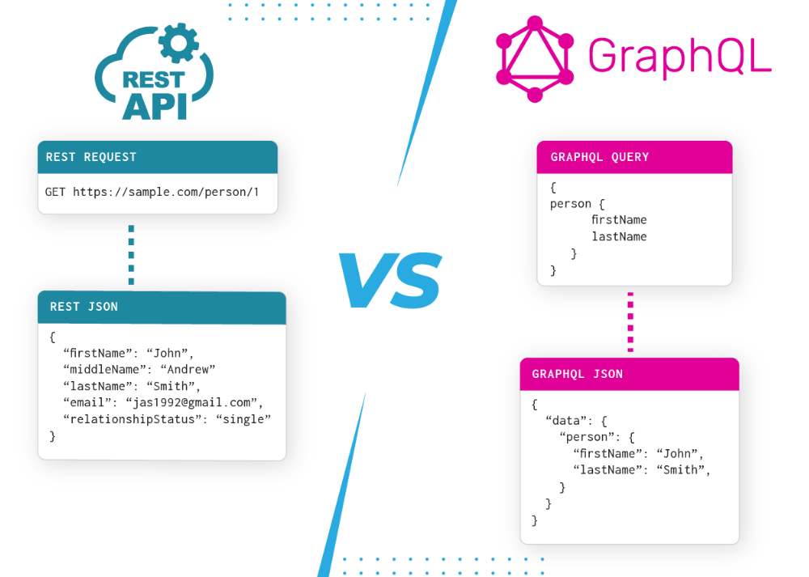
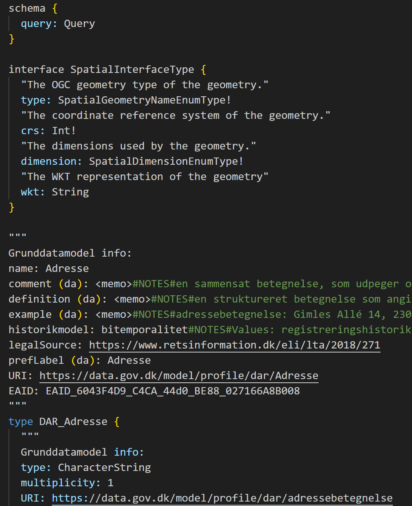
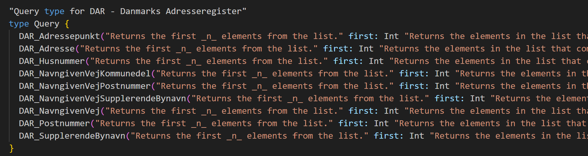
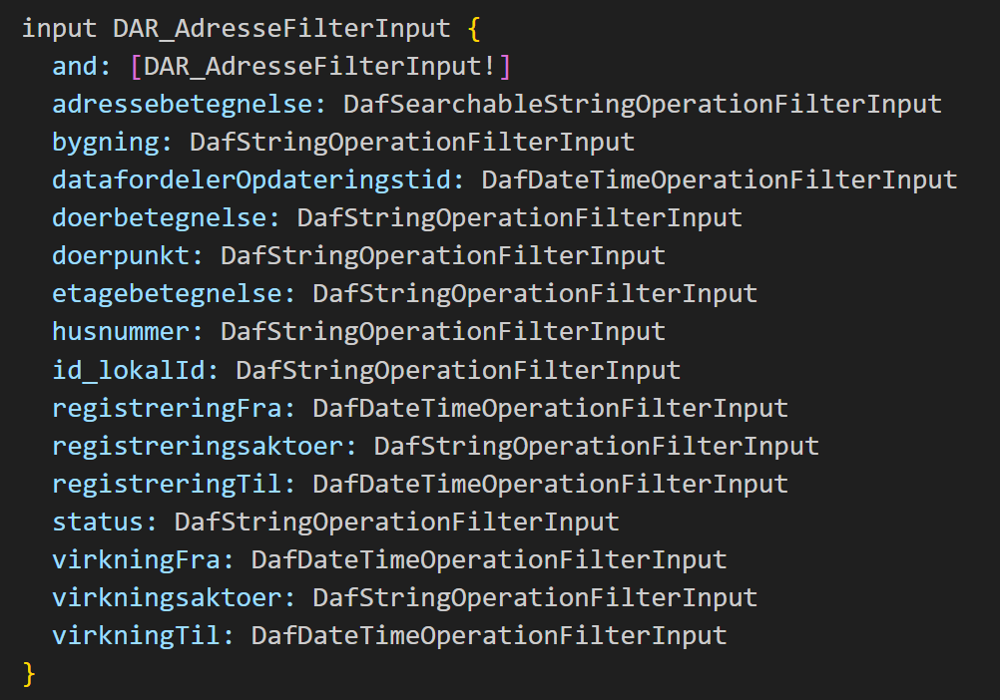
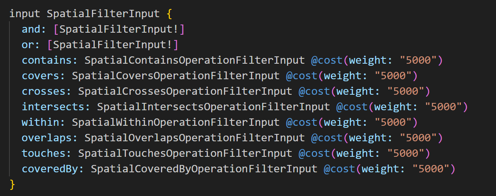
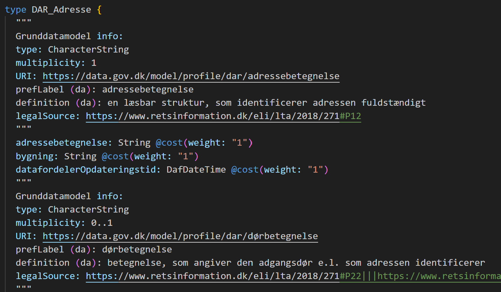

<!-- backgroundColor: #2e495c -->

<h1 style="font-size:80px;color:white">GraphQL på Datafordeleren</h1>

<h1 style="font-size:30px;color:white">Morten Fuglsang, Septima</h1>


<style>
section::after {
  content: attr(data-marpit-pagination) '/' attr(data-marpit-pagination-total);
}
</style>

---


<h1 style="font-size:50px;color:white">Hvorfor dette Oplæg ?</h1>
<br>


---


<h1 style="font-size:50px;color:white">Introduktion til GraphQL</h1>

---


<h1 style="font-size:50px;color:white">Hvorfor GraphQL</h1>

<h2>REST er langt hen ad vejen den dominerende API type </h2>

Udfordringer med REST:

* Overfetching og underfetching af data

* Mange API-kald for at hente relaterede data

* Vanskeligt at tilpasse data til forskellige klienter (web, mobil)

---


<h1 style="font-size:50px;color:white">Fødselen af GraphQL hos Facebook</h1>

* Skabt af Facebook i 2012 som intern løsning

* Bruges først i deres mobile app til nyhedsfeedet

* Offentliggjort som open source i 2015

* Formål: Effektiv og fleksibel datatilgængelighed med ét enkelt kald


---


<h1 style="font-size:50px;color:white">GraphQL i dag</h1>

* Bred adoption hos store virksomheder (GitHub, Shopify, Twitter)

* Bruges til både frontend og backend integrationer

* Aktivt community og voksende økosystem (Apollo, Relay, Hasura osv.)

Et paradigmeskifte: fra ressourcer til grafer


---


<h1 style="font-size:50px;color:white">Hvad er en graf ?</h1>

En **graf** består af:

- **Noder (nodes):** Objekter som fx `Bruger`, `Adresse`, `Postnummer`, `bygning`
- **Kanter (edges):** Relationer mellem objekterne (fx en bruger har en adresse, der ligger i en bygning osv.)
- **Felter (fields):** Informationer på hver node

En GraphQL-query følger forbindelserne i grafen  
Du kan spørge på tværs af datarelationer – fleksibelt

---


<h1 style="font-size:50px;color:white">Hvad er en query ?</h1>

<div class="container">
<div class="col">

**Query**: Nøgleordet for en læseoperation

Vi beder om et user-objekt med id = "123"

Vi specificerer præcis hvilke felter vi vil have: id, name, email

</div>

<div class="col">

```graphql
query {
  user(id: "123") {
    id
    name
    email
  }
}
```
</div>
</div>

---


<h1 style="font-size:50px;color:white">Hvordan sender man en forespørgsel ?</h1>

GraphQL bruger som regel HTTP POST (kan også være GET)
Body’en indeholder query som tekst ('Næsten' JSON)

```http
POST /graphql
Content-Type: application/json

{
  "query": "query { user(id: \"123\") { name email } }"
}
```

---


<h1 style="font-size:50px;color:white">Applikationer</h1>

Man kan i praksis godt bygge en **GET** url, men der skal url-encodes en masse ting.

I praksis vil man ofte benytte en applikation der kan lave **POST** forespørgsler:

* Postman / Insomnia / Altair

* Apollo Client

* curl

* GraphQL Playground / GraphiQL

---


<h1 style="font-size:50px;color:white">Response</h1>

<div class="container">
<div class="col">

Response indeholder kun de felter der blev forespurgt

Ingen overflødig data – ingen status, links, osv.

Altid under data-nøglen (fejl kommer i errors)

</div>

<div class="col">

```json
{
  "data": {
    "user": {
      "name": "Alice",
      "email": "alice@example.com"
    }
  }
}

```
</div>
</div>

---




---


<h1 style="font-size:50px;color:white">GraphQL schemas</h1>

Et **GraphQL-schema** definerer de typer og felter, du kan spørge om i API’et.

Schemaet fungerer som:
- En **kontrakt** mellem klient og server
- En **struktur** over alle data og deres relationer
- En **validering** af dine queries

Et schema består af:
- `type` – definerer objekttyper (f.eks. `Adresse`, `Vejstykke`)
- `Query` – definerer tilgængelige læseoperationer

Det hele er stærkt typet og dokumenteret...


---

<h1 style="font-size:40px;color:white">Eksempel fra Datafordeleren</h1>

```graphql
query {
    BBR_Bygning( # Entitet
        where: { # Standardfiltre
            kommunekode: { eq: "0550" }
            virkningsaktoer: { startsWith: "Konvertering" }
        }
        virkningstid: "2024-11-12T14:41:33Z" # Bitemporalt filter
        first: 10 # Paging
        ) {
        pageInfo { # Paginginformation
            startCursor
            endCursor
            hasNextPage
            hasPreviousPage
        }
        nodes {
            id_lokalId
            kommunekode
            virkningsaktoer
        }
    }
}
```

---


</br>

- **Entitet** : Hver query skal specificere hvilken entitet den omhandler. Eksemplet
ovenfor viser en query for entiteten BBR_Bygning fra BBR og specifikt kun for 3 kolonner (angivet i ”nodes”): id_lokalId, kommunekode og virkningsaktoer.
- **Endepunkt**: En query sendes til et GraphQL-endepunkt som et GET- eller POSTrequest.
- **Standardfiltre**: En query kan indeholde standardfiltre der filtrerer data. Query’en
ovenfor indeholder to standardfiltre: et lighedsfilter (eq: "0550") på kommunekode-kolonnen og et tekstfilter (startsWith: "Konvertering") på virkningsaktoer-kolonnen.

---


</br>

- **Geometriske filtre**: En query kan indeholde geometriske filtre, der filtrerer
data på baggrund af geometri.
- **Bitemporale filtre**: En query kan også indeholde bitemporale filtre. Query’en oven
for indeholder et bitemporalt point-in-time-filter (virkningstid: "2024-11-12T14:41:33Z") på virkningstidspunktet.
- **Paging** : En query kan også definere hvordan data pagineres. Query’en oven for returnerer de første 10 rækker (first: 10) givet filtreringen samt paginginformation for resultatsættet (angivet i ”pageInfo”). 


---


<h1 style="font-size:60px;color:white">Hvordan får man adgang ? </h1>

---


<div class="container">
<div class="col">


</br>
</br>

* Det er nødvendigt at etablere en ny type adgang - det er ikke længere nok med en webbruger og en tjenestebruger.

* Hvis man skal have adgang til frie data, er en token nok, men den skal oprettes

</div>

<div class="col">
</br>
</br>


</div>
</div>

---


---

<h1 style="font-size:60px;color:white">Lad os hente nogle schemaer </h1>

graphql.datafordeler.dk/DAR/v1/schema?apiKey=API-KEY

graphql.datafordeler.dk/BBR/v1/schema?apiKey=API-KEY

graphql.datafordeler.dk/MAT/v1/schema?apiKey=API-KEY


</br>
</br>
Vi starter med at kigge nærmere på DAR schemaet...


---


<div class="container">
<div class="col">


<h1 style="font-size:50px;color:white">Elementer</h1>


* <h3 style="font-size:40px;color:white">Metadata</h3>


* <h3 style="font-size:40px;color:white">Query types</h3>


* <h3 style="font-size:40px;color:white">Filter inputs</h3>


* <h3 style="font-size:40px;color:white">Spatiale filtre</h3>

</div>

<div class="col">
</br>
</br>


</div>
</div>

---


<h1 style="font-size:60px;color:white">Query types</h1>



---


<h1 style="font-size:60px;color:white">Filter inputs</h1>



---


<h1 style="font-size:60px;color:white">Spatial Filters</h1>



---


<h1 style="font-size:60px;color:white">Metadata</h1>



---


<h1 style="font-size:40px;color:white">Hvordan sender man en POST forespørgsel ?</h1>

Det er kompliceret at lave en GET - det er bedre at sende et POST request afsted.

* Dette kan gøres med en række forskellige stykker software - Jeg bruger Postman til mine eksempler:

www.postman.com/

---


<h1 style="font-size:40px;color:white">Basis request</h1>

Endpoint : graphql.datafordeler.dk/DAR/v1?apiKey=**API-KEY**

```graphql
query {
  DAR_Adresse(
    registreringstid: "2025-06-04T00:00:00Z"
    virkningstid:  "2025-06-04T00:00:00Z"
    first: 10
  ) {
    nodes {
      adressebetegnelse
      id_lokalId
      husnummer
      doerbetegnelse
      etagebetegnelse
      status
      registreringFra
      virkningFra
    }
  }
}

```

---


<h1 style="font-size:50px;color:white">Alle ressourcer vi har brugt i dag, kan hentes på Github </h1>

</br>

Github.com/MFuglsang/graphql_datafordeleren

</br>

Her er bla. en pdf med en lang række eksempler - langt flere end vi har vist her...

---


<h1 style="font-size:50px;color:white">Tak for i dag</h1>
<h2 style="font-size:30px;color:white">Har i spørgsmål efterfølgende, så hiv gerne fat i mig : morten.fuglsang@septima.dk</h2>